# Procesverslag
Markdown is een simpele manier om HTML te schrijven.  
Markdown cheat cheet: [Hulp bij het schrijven van Markdown](https://github.com/adam-p/markdown-here/wiki/Markdown-Cheatsheet).

Nb. De standaardstructuur en de spartaanse opmaak van de README.md zijn helemaal prima. Het gaat om de inhoud van je procesverslag. Besteedt de tijd voor pracht en praal aan je website.

Nb. Door *open* toe te voegen aan een *details* element kun je deze standaard open zetten. Fijn om dat steeds voor de relevante stuk(ken) te doen.

## Jij

  
uitwerken voor kick-off werkgroep

  ### Auteur:
  Po Trng Man

  #### Je startniveau:
  Blauwe piste

  #### Je focus:
  Surface plane
 

## Je website

  
uitwerken voor kick-off werkgroep

  ### Je opdracht:
https://www.pathe.nl

  #### Screenshot(s) van de eerste pagina (small screen): 
  hier de naam van de pagina  
  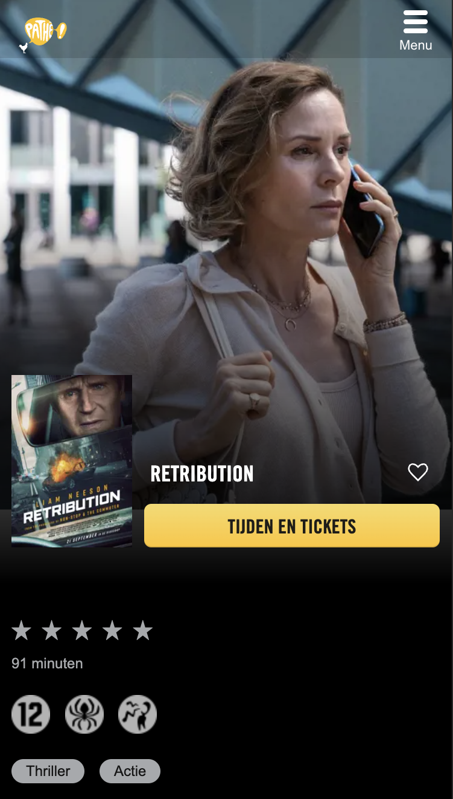

  #### Screenshot(s) van de tweede pagina (small screen):
  hier de naam van de pagina  
  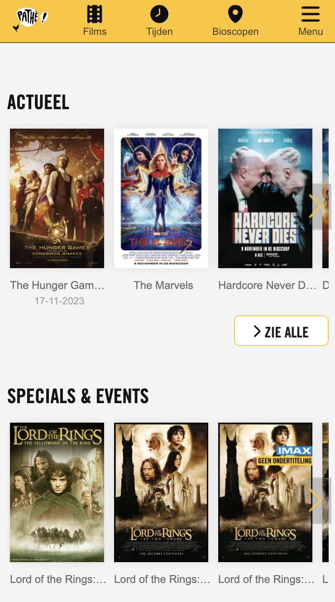
 

## Toegankelijkheidstest 1/2 (week 1)

  
uitwerken na test in 2e werkgroep

Ik heb een ballon gebruikt om concentratie problemen na te boosten.
Ik vond het erg lastig om de screenreader te gebruiken op mijn Macbook maar na een aantal keer geprobeerd te hebben is het mij gelukt.

[control + option + command + pijltje links en rechts = rotor navigatie
control + option + command + pijltje boven en onder = kiezen]

  ### Bevindingen
  Lijst met je bevindingen die in de test naar voren kwamen:

  Concentratie probleem
- Je kan weinig lezen 
- Alles beweegt en je let eerder op de ballon 

screenreader
- leest alle links op ipv de namen van waar de links naar toe gaan
- lees meer... maar waarover lees ik meer
- Het menu klapt niet open wanneer je gebruikt maakt van de screenreader 
- Het lezen van de headings gaat erg moeizaam omdat het niet alle kopjes opleest, het springt van 2 naar 4. Terwijl ik ook H1 en H3 mis. 
- De menu leest alle kopjes als H4
- De links geven goed uitleg wat je kan zien maar nog iets te kort van wat het echt laat zien
- Je kan niet door de website heen tabben

## Breakdownschets (week 1)

  
uitwerken na afloop 3e werkgroep

  ### de hele pagina: 
  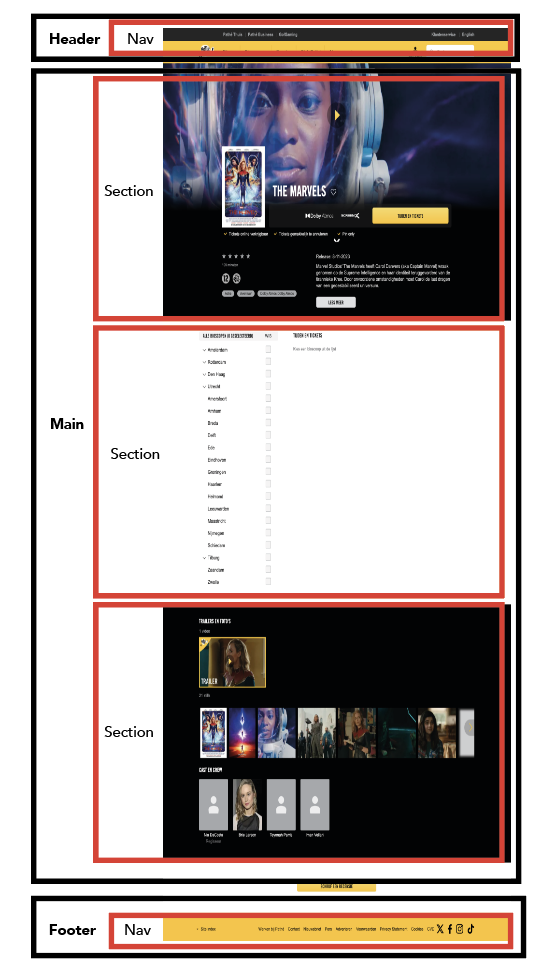

  ### dynamisch deel (bijv menu): 
  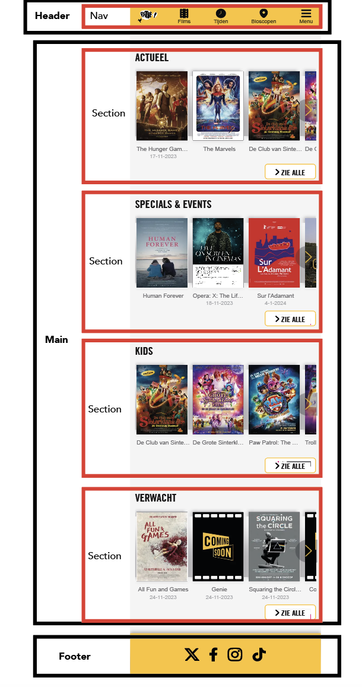

  ### wellicht nog een dynamisch deel (bijv filter): 
  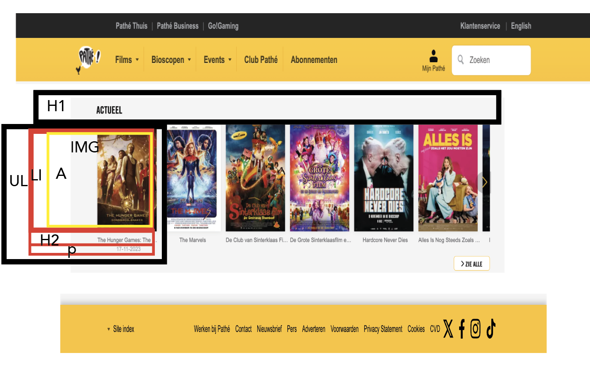

## Voortgang 1 (week 2)

  
uitwerken voor 1e voortgang

  ### Stand van zaken
  hier dit ging goed & dit was lastig (neem ook screenshots op van delen van je website en code)

Oefeningen gaan grotendeels goed alleen bij oefeningen met Grid vind ik dat nog erg lastig. Maar alle andere oefeningen waren wel te doen. Omdat ik zoveel tijd heb besteed om de oefeningen te snappen en goed te doen heb ik weinig tot geen tijd gehad om aan mijn website te zitten. Ook vind ik het erg lastig om de stap van de oefeningen naar je eigen website te maken. Want bij alle oefeningen staat alles op de juiste volgorde en is het eigenlijk al voor je voorgetypt en weet je wat er van je verwacht wordt en wat het uiteindelijke resultaat moet zijn en de stappen daarvan. In je eigen website moet je het zelf uitvogelen en dat vind ik erg moeilijk.

  ### Agenda voor meeting
  samen met je groepje opstellen

Po Trng 
Lastig van oefening naar eigen werk.

David 
Vindt Javascript lastig. 

Madelief
Vindt Javascript moeilijk.

Eline 
Twijfelt nog welke website ze moet kiezen.

  ### Verslag van meeting
  hier na afloop snel de uitkomsten van de meeting vastleggen

  - Je hoeft niet exact de site na te maken
  - Probeer geen pixels te gebruiken in CSS maar em of een ander alternatief 
  - Je bent goed op weg

## Voortgang 2 (week 3)

  
uitwerken voor 2e voortgang

  ### Stand van zaken
  hier dit ging goed & dit was lastig (neem ook screenshots op van delen van je website en code)

  De oefeningen blijf ik steeds maken maar blijf wel bij mijn eigen piste. Verder de eerste pagina uitgewerkt en het was lastig om de foto's op dezelfde hoogte en breedte te zetten. De 'postion' van mijn navigatie was verkeerd omdat mijn H1 niet zichtbaar was op mijn website. Omdat ik bij position:absolute was en niet sticky. Ik heb in de werkgroep geleerd dat het aan de bovenkant moest plakken zodat de andere content wel zichtbaar was op mijn website.

  - Vragen voor mijn tweede pagina waarom ik er geen tekst onder kan zetten zonder dat H2 verschuift.
  - Scrollen website? Overflow? 

  ### Verslag van meeting
  hier na afloop snel de uitkomsten van de meeting vastleggen

  - Ik hield me heel erg vast bij de gedachte dat als we selectoren niet mogen gebruiken dat het niet verboden is. Ik heb tijdens het gesprek de class op mijn tweede html pagina geplaatst zodat ik makkelijker de tweede pagina kan stylen. 
  - Het verschil van nth-last-child of -type vind ik nog erg lastig soms om ze te onderscheiden. Ik heb geleerd dat type gebruiken beter is dan child. 
  - Als je alleen items wilt stylen en je kan ze moeilijk aanroepen in de css mag je div gebruiken daar twijfelde ik namelijk bij.
- Ik gaf aan tijdens het voortganggesprek dat ik moeite had en niet zo goed weet wanneer je een section gebruikt of article etc. 

## Toegankelijkheidstest 2/2 (week 4)

  
uitwerken na test in 9e werkgroep

  ### Bevindingen
  Lijst met je bevindingen die in de test naar voren kwamen (geef ook aan wat er verbeterd is):

Screenreader test 
- Ik kan heel gemakkelijk door de website heen tabben.
- In het hamburger menu wordt elke regel twee keer opgenoemd dus 'Films' 'Films'. Ik heb hiervoor de alt tekst verwijderd zodat alleen de tekst die er al voor staat opgelezen wordt. Dan hoor je het niet meer twee keer maar een keer. Later ben ik erachter gekomen dat het niet mogelijk is om de alt text te verwijderen want een image text kan niet zonder alt dan krijg je een error. 
- Zie alle buttons worden opgenoemd als zie alle hoofd. 
- De checkboxes worden niet opgenoemd/ de tekst ook niet (selectievakje uitgeschakeld) - ik heb hiervoor aria-label toegevoegd en nu leest het de locaties wel op maar ik hoor nog steeds (selectievakje uitgeschakeld).
- Hij leest alle kopjes goed door. 
- Alle links worden goed opgelezen met een logische zin. 

WCAG Checklist
- Ik moet bij de tweede pagina met H1 want ik begin nu met een H2. 
- Ik moet de Alt texten bij plaatjes meer specificeren want bij de tweede pagina heb ik een section met vier keer 'The Hunger Games'. 
- Nog een darkmode proberen toe te voegen voor de UX verbeteren. 
- De image voor de tweede pagina overlapt het Youtube filmpje net iets teveel. 

## Voortgang 3 (week 4)

  
uitwerken voor 3e voortgang

  ### Stand van zaken
  hier dit ging goed & dit was lastig (neem ook screenshots op van delen van je website en code)

- Checkboxes probleem tweede pagina 
- Dark/ Light mode toepassen, heb daar veel moeite mee en kan nergens iets op internet vinden dat geen classes/ div's en id's bevatten. Geen duidelijk beeld wat wel en niet mag. 
- Toegankelijkheid of het een groot probleem is als je heel lang moet tabben om naar een ander kopje te gaan of dat het opgelost kan worden.

  ### Verslag van meeting
  hier na afloop snel de uitkomsten van de meeting vastleggen

  - Checkboxes in een ul/ li zetten en dan flexbox. Misschien werkt dat om de checkboxes naast de text te zetten. 
  - Iframe in mp4 zetten zodat je geen error meer hebt dat kan je proberen.
  - Focus whitin/ focus visible voor tabben toegankelijkheid. 
  - Dark/light mode in de root passen CSS is gelukt. Ik weet nu ook waarom en wat ik ook doe. 

## Eindgesprek (week 5)

  
uitwerken voor eindgesprek

  ### Je uitkomst - karakteristiek screenshots:
  

 
  ### Dit ging goed/Heb ik geleerd: 
  Korte omschrijving met plaatjes

Het viel mij enorm op tijdens de toegankelijkheids test dat als ik aan het tabben was door mijn website dat hij door mijn menu gaat maar daarna verdwijnt en niet meer weet waar je aan het tabben bent. Hij gaat dan door mijn hele menu heen maar dat is niet zichtbaar. Ik heb dit als vraag gesteld tijdens het voortganggesprek en daarin heb ik geleerd over focus within. Ik heb de bron bij de bronnenlijst gezet waar ik meer informatie over hebt geleerd. 
  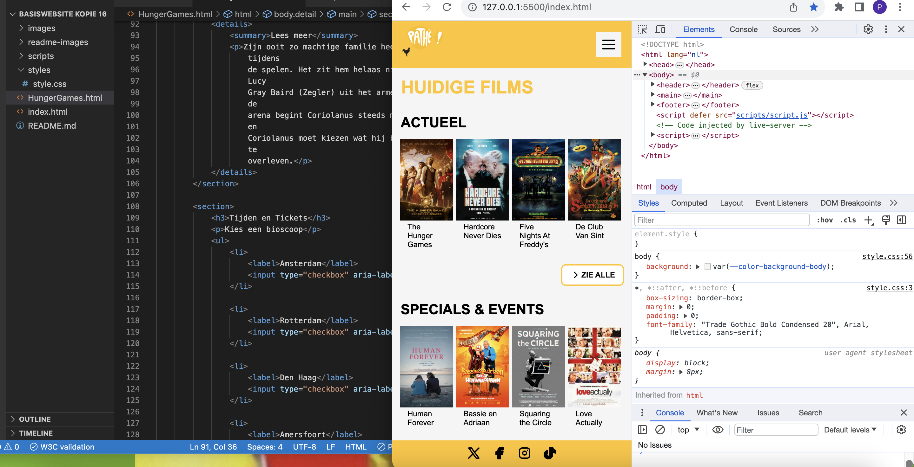

Hoe meer ik bezig was met het stylen van mijn website ging het steeds makkelijker met het aanroepen van bepaalde html elementen in mijn Css. Daar ben ik wel blij mee en kreeg ik langzamerhand ook het gevoel waar ik nou mee bezig was! Zoals de attribute en de verschillende Css selectoren te gebruiken. 

  ### Dit was lastig/Is niet gelukt:
  Korte omschrijving met plaatjes

Ik wilde een slider toepassen zodat je door verschillende plaatjes kon doorscrollen. Doormiddel van een Youtube Filmpje heb ik gezien dat je overflow-x : auto kan gebruiken om een slider toe te passen. Het is veel moeilijker als je alles al hebt staan en dingen wilt veranderen. Alles gaat dan verschuiven en dan heb je niet echt overzicht meer van wat je nou moet aanspreken. Zoals je kan zien in de screenshot deed mijn button raar en kreeg ik hem niet meer normaal op mijn website. Ik had niet genoeg tijd om mijn hele voorpagina om te gooien en de slider toe te passen. 
  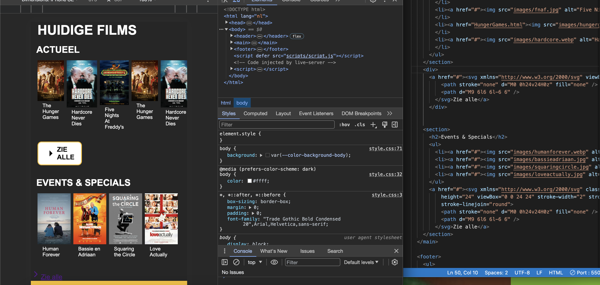

Ik heb bij het voortganggesprek aangegeven dat ik een error had in mijn Html en dat was bij mijn Youtube filmpje. Er werd als tip gegeven dat ik het in een Mp4 bestand kan doen. Wanneer ik het in een Mp4 bestand deed kreeg ik het filmpje niet meer te zien. Ook heb ik geprobeerd het filmpje zelf op te slaan in mijn bestand en het dan aanroepen in mijn Html dat lukte helaas ook niet.
  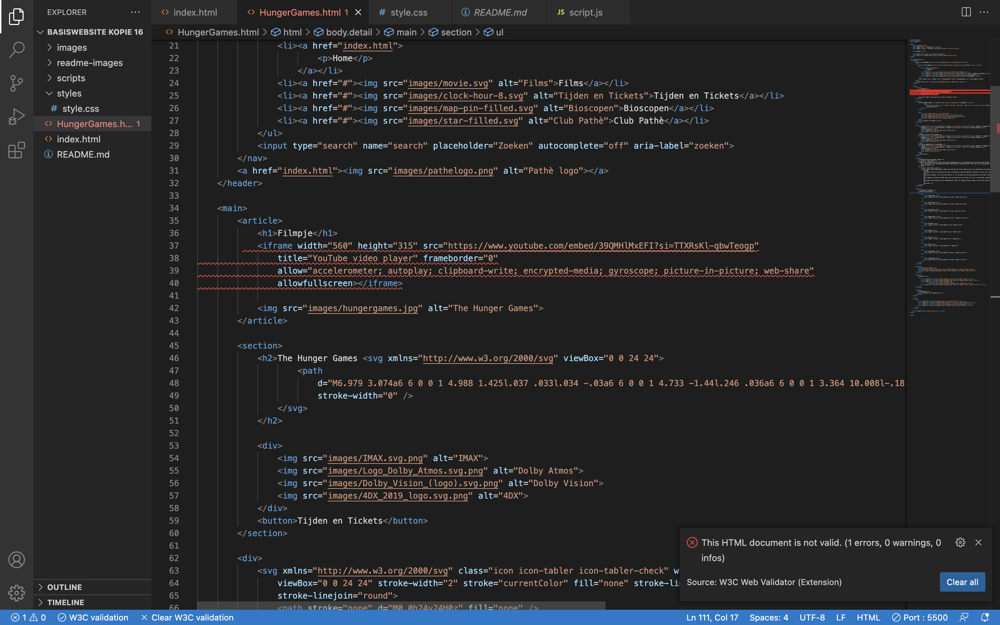

WCAG Checklist

 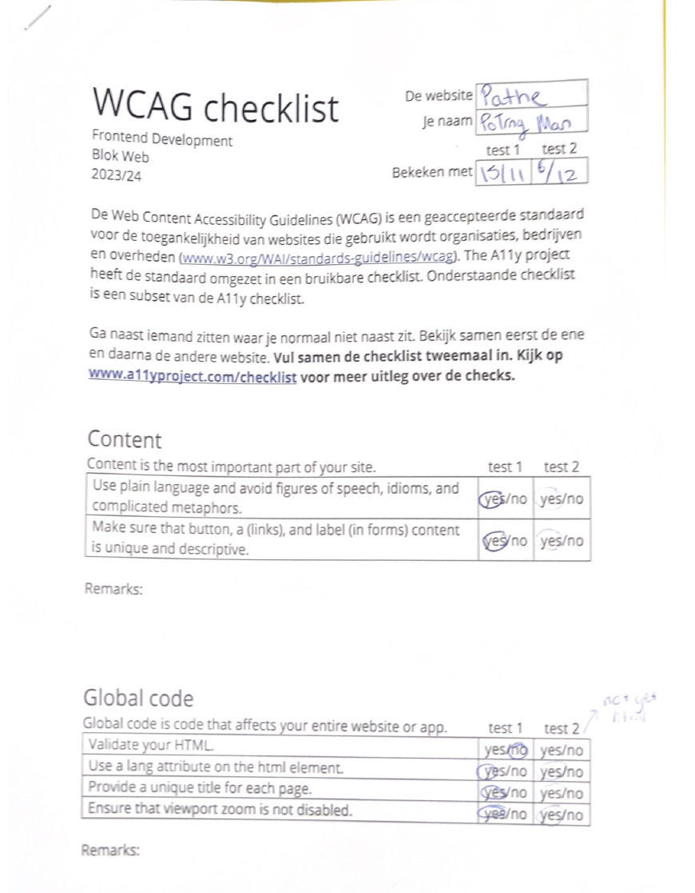

 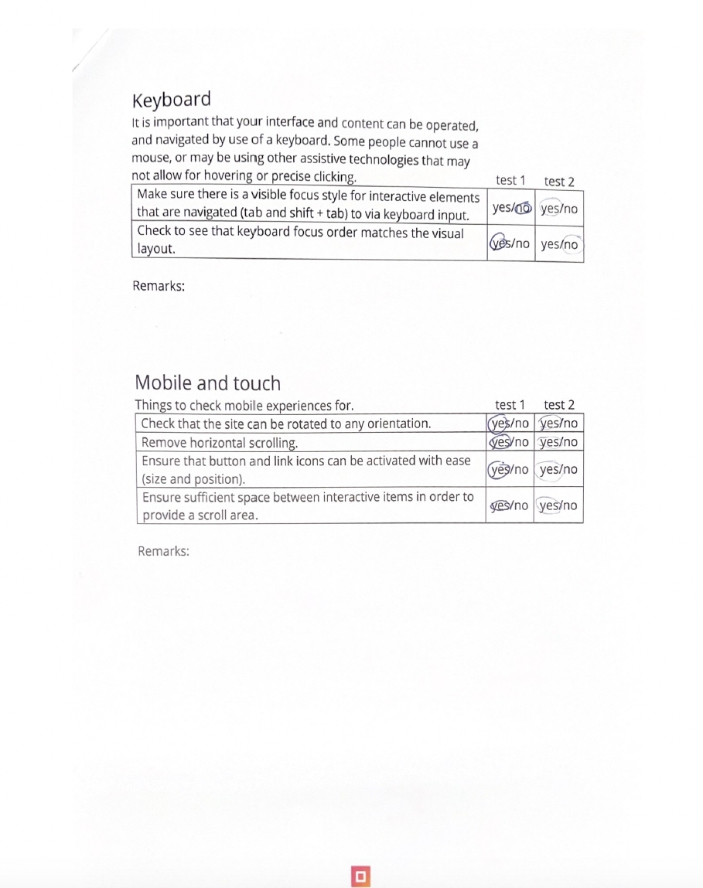

  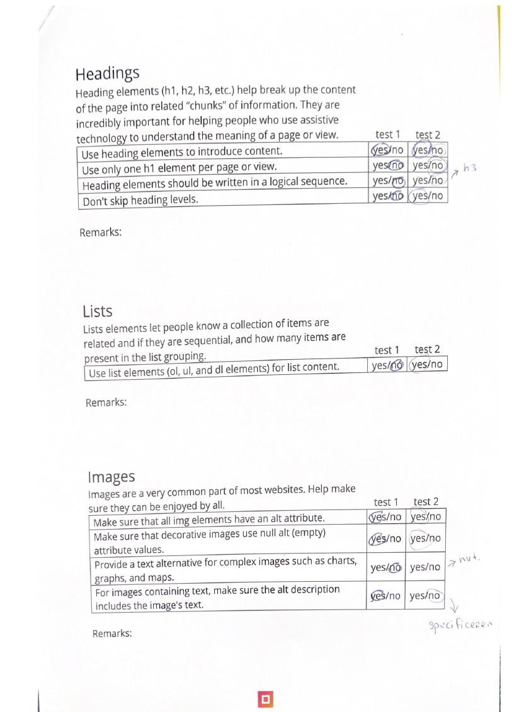

  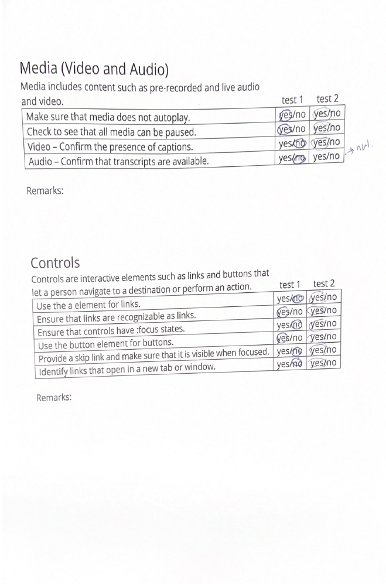

  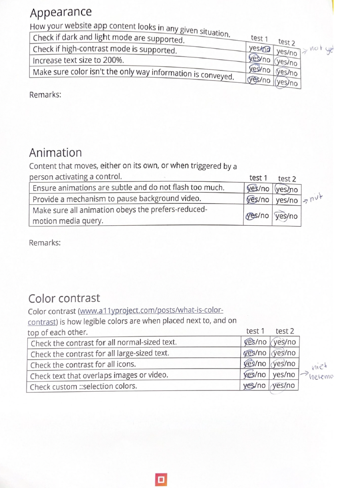

## Herkansing eindgesprek 25 januari 2024

Ik kreeg een 4,5 voor het FED eindgesprek. De feedback was dat ik alle interactieve elementen ook interactief moest maken. 

Ook moest ik zorgen dat dingen goed op hun plek moesten staan. Ik was namelijk meer gefocust op de code dan echt alle kleine details qua vormgeving. Dus dat vond ik erg jammer.

  ### Dit ging goed:
Ik vond het zonde dat ik op kleine puntjes werd beoordeeld. Maar zag het als kans en een uitdaging om 10x meer te laten zien. Ook uit angst dat ik het weer niet zal halen of dat ik het net aan zou halen. 

Ik begon eerst met de feedback te verwerken en alle interactieve elementen interactief gemaakt en een active state bij toegevoegd. Ook heb ik goed gekeken welke punten netter konden. Wanneer ik die twee had gedaan keek ik verder wat ik nog meer kon toepassen op mijn website. 

Daarna begon ik te kijken wat ik nog meer kon toevoegen qua interacties en animaties op mijn website. Op de hoofdpagina heb ik bij twee foto's animaties toegepast om de foto er meer uit te laten springen. 

Ik heb daarna een extra pagina eronder toegevoegd wat niet bepaald echt bij de vormgeving past maar het laat wel zien dat ik verschillende dingen kan toepassen. 

Bij de tweede pagina heb ik alles goed gelijnd onder elkaar en de checkboxes ingekleurd. Die hebben een oranje kleur als je ze aanvinkt. 

Ik heb bij beide pagina's goed gekeken of alles zichtbaar is wanneer je de dark mode inzit. Want daar had ik een klein foutje gemaakt bij het vorige eindgesprek.

  ### Dit was lastig/Is niet gelukt:
Ik wilde mezelf uitdagen om weer een poging te doen om een slider toe te passen wat in theorie wel te doen is. Ik kwam in de knoop met de afbeeldingen, hoe meer afbeeldingen ik naast elkaar zette hoe kleiner de afbeeldingen werden. De slider was wel toegepast maar de afbeeldingen waren niet te zien. Ik probeerde zelf te zoeken waar de fout was maar kon het niet echt vinden dus heb ik het maar gelaten voor wat het was. 

## Bronnenlijst

  
continu bijhouden terwijl je werkt

  Nb. Wees specifiek ('css-tricks' als bron is bijv. niet specifiek genoeg). 
  Nb. ChatGpT en andere AI horen er ook bij.
  Nb. Vermeld de bronnen ook in je code.

  1. https://tabler-icons.io (Iconen gebruik)
  2. https://www.youtube.com/watch?v=ly36kn0ug4k (Youtube filmpje in html/css zetten)
  3. https://developer.mozilla.org/en-US/docs/Web/CSS/z-index (Navigatie en Youtube filmpje stond niet goed onder elkaar, gebruik gemaakt van Z Index voor position:relative)
  4. https://css-tricks.com/focusing-on-focus-styles/ (:Focus states styling voor het tabben )
  5. https://developer.mozilla.org/en-US/docs/Web/CSS/:focus-within (:focus-within meer informatie)
  6. https://developer.mozilla.org/en-US/docs/Web/CSS/:hover (:hover styling meer informatie)
  7. https://developer.mozilla.org/en-US/docs/Web/Accessibility/ARIA/Attributes/aria-hidden (aria-hidden gebruikt voor nav menu).
  8. https://developer.mozilla.org/en-US/docs/Web/Accessibility/ARIA/Attributes/aria-label (Aria Label gebruikt voor checkboxes op te noemen bij screenreader)
  9. https://developer.mozilla.org/en-US/docs/Web/CSS/CSS_animations/Using_CSS_animations (Voor animaties extra info)
  10. https://sentry.io/answers/how-to-style-a-checkbox-using-css/ (info voor styling checkboxes)
  11. Alle foto's/ video's komen van de Pathė site zelf. 

